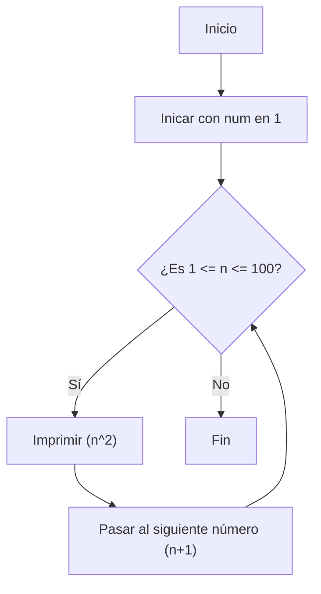
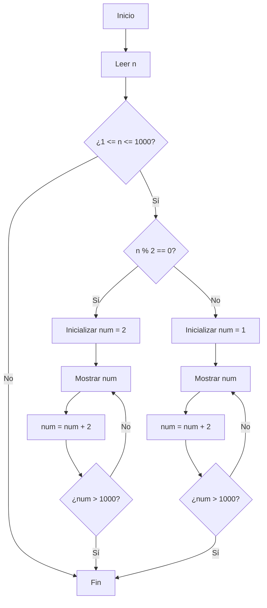
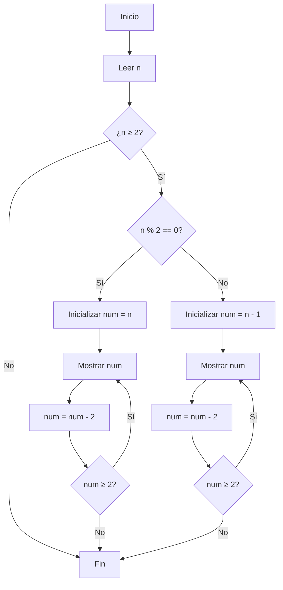

# RETO_06
Desarrollo de los ejercicios puestos en clase. Para cada punto se creo un programa individual en VS Code y asimismo se creo un notebook con la solución a todos los problemas. Además se hizo un diagrama de flujo para los primeros 3 puntos pero desde GitHub(Ya que no supe como hacerlo en VS Code y preferí hacerlo con mermaid directamente en el repo).

En esta parte solo veremos los diagramas de flujo ya que adjuntos están las soluciones de cada uno de los puntos

### 1. Imprimir un listado con los números del 1 al 100 cada uno con su respectivo cuadrado.

### 2. Imprimir un listado con los números impares y pares del 1 al 1000.

### 3. Imprimir los números pares en forma descendente hasta 2 que son menores o iguales a un número natural n ≥ 2 dado

